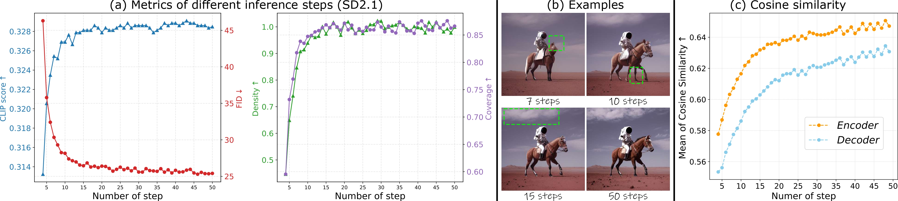
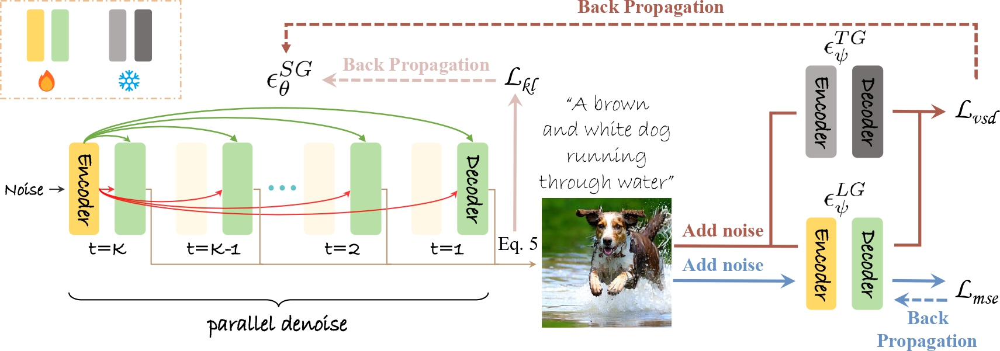

## Official Implementations "One-Way Ticket : Time-Independent Unified Encoder for Distilling Text-to-Image Diffusion Models" (CVPR'25)

[](https://arxiv.org/abs/2505.21960) [](https://arxiv.org/pdf/2505.21960) [](https://drive.google.com/file/d/1CenAPN9qPvBhDCc0Za6Fx6yXGXZCMpst/view?usp=sharing) [](https://drive.google.com/file/d/1zE3oCxM-5EzPRfvkW29We0AKGNowkrgp/view)  


---



Above a certain threshold of steps, such as 15 steps in SD2.1, the model maintains image generation quality (Fig.a-b) while the features show high similarity (Fig.c). Below this threshold, feature similarity deteriorates along with worse generation quality, accompanied by a degradation in image generation quality as sampling steps reduce. Furthermore, the encoder features consistently exhibit higher similarity than the decoder across all sampling steps (Fig.c). Additionally, the decoder feature always shows much higher variations than encoder (Fig.c).

Hence, we use a novel design with 1-step encoder and a 4-step decoder (Time-independent Unified Encoder architecture), achieving near 1-step inference. Since the 4-step decoder captures richer semantics, ours aligns the generation quality with multi-step DMs.

---


Building on our Time-independent Unified Encoder (TiUE) architecture, we introduce a loop-free distillation approach. 

### Update
- **2025.05.16**: Release training code. 
- **2025.04.22**: Release the pre-trained models for [Loopfree SD1.5](https://huggingface.co/senmaonk/loopfree-sd1.5) and [Loopfree SD2.1-Base](https://huggingface.co/senmaonk/loopfree-sd2.1-base), and inference code. 😀
- **2025.03.15**: This repo is created.

### TODO
- [x] Release inference code and weight
- [x] Release training code

---

### Dependencies and Installation

```
# git clone this repository
git clone https://github.com/sen-mao/Loopfree.git
cd Loopfree

# create new anaconda env
conda create -n loopfree python=3.8 -y
conda activate loopfree

# install python dependencies
pip3 install -r requirements.txt
```

### Inference

```
# Loopfree SD1.5
python loopfree.py --pretrained_model_name_or_path senmaonk/loopfree-sd1.5 \
                   --output_dir loopfree-sd1.5 --use_parallel
```

```
# Loopfree SD2.1-Base
python loopfree.py --pretrained_model_name_or_path senmaonk/loopfree-sd2.1-base \
                   --output_dir loopfree-sd2.1-base --use_parallel
```

### Training
In [JourneyDB datasets](https://journeydb.github.io/), there are 4M (4,189,737) captions in the training sets. 
We remove duplicate captions from the training set, leaving [1,418,723 unique captions](https://drive.google.com/file/d/1Qi4SyojlUpGPPwYgvZMUM6dyuZdSaZIv/view?usp=sharing) (1.4M). These captions are used as prompts to train the student generator.

Simply run the following command to train a Loopfree model (SD2.1):

```
bash train_loopfree.sh
```

Note: The results in the paper do not use CLIP loss for aligning the text prompt with the generated image. To enable explicit alignment, use `--lambda_textcliploss 0.35`.
The released pre-trained models are further fine-tuned by adding CLIP loss for an additional 10k iterations.

### Citation
If our work is useful for your research, please consider citing:

    @inproceedings{li2025one,
          title={One-Way Ticket: Time-Independent Unified Encoder for Distilling Text-to-Image Diffusion Models}, 
          author={Li, Senmao and Wang, Lei and Wang, Kai and Liu, Tao and Xie, Jiehang and van de Weijer, Joost and Khan, Fahad Shahbaz and Yang, Shiqi and Wang, Yaxing and Yang, Jian},
          booktitle={IEEE Conference on Computer Vision and Pattern Recognition (CVPR)}, 
          year={2025},
    }

### License

Licensed under a [Creative Commons Attribution-NonCommercial 4.0 International](https://creativecommons.org/licenses/by-nc/4.0/) for Non-commercial use only.
Any commercial use should get formal permission first.

### Acknowledgement

This project is based on [SwiftBrush](https://github.com/VinAIResearch/SwiftBrush). Thanks for their awesome works.
### Contact
If you have any questions, please feel free to reach out to me at  `senmaonk@gmail.com`. 
